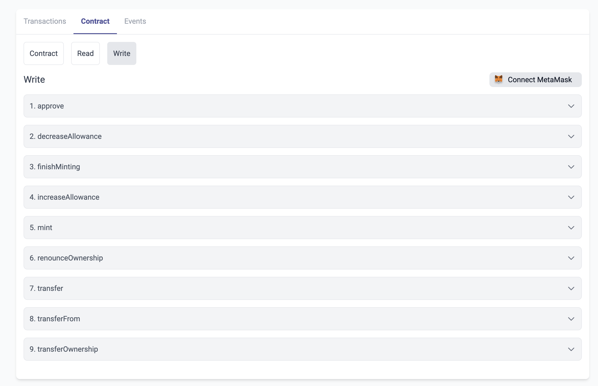

# id706 Contract page - Pages - Artifacts ("Write" tab for verified contract)

## Description
  - https://staging-scan-v2.zksync.dev/address/contract_address (e.g. 0x1bAbcaeA2e4BE1f1e1A149c454806F2D21d7f47C)
  - Prerequisites: (you can use https://github.com/JackHamer09/zkSync-2.0-Hardhat-example guide) or search for 0xaed6e18d8fe6397fc622a17402e8eb350d6d6c45 contract
  - 1. upload your own contract with methods
  - 2. verify this contract

## Precondition

## Scenario
- Write tab for verified contract contains:
    - "Write" method components list
    - Label - Description of the parameter
- Label - Type of this parameter
- Optional - Input for this parameter
- "Write" button (if MetaMask is connected)
  