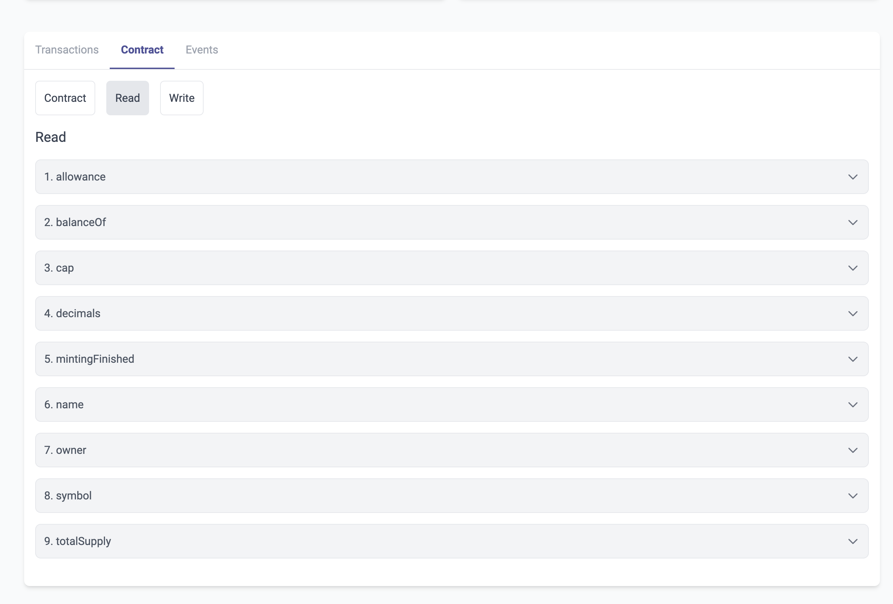

# id707 Contract page - Pages - Artifacts ("Read" tab for verified contract)

## Description
  - https://staging-scan-v2.zksync.dev/address/contract_address
  - Prerequisites: (you can use https://github.com/JackHamer09/zkSync-2.0-Hardhat-example guide) or search for 0xaed6e18d8fe6397fc622a17402e8eb350d6d6c45 contract
  - 1. upload your own contract with methods
  - 2. verify this contract

## Precondition

## Scenario
- Contract tab for verified contract contains:
    - "Read" method components list
    - Label - Description of the parameter
- Label - Type of this parameter
- Input for this parameter (if available)
- "Query" button
  