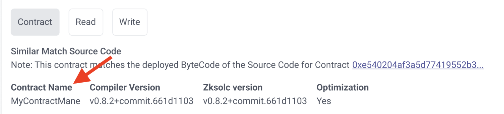
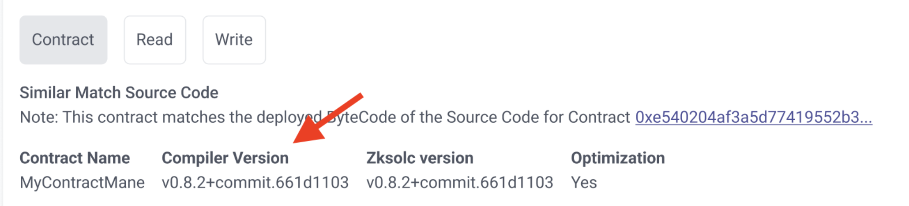
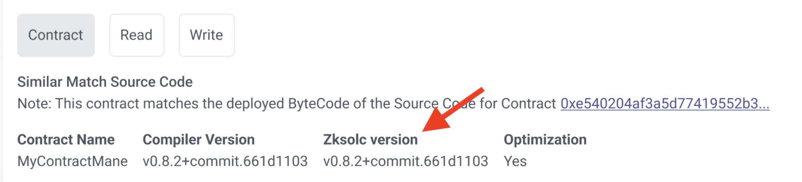
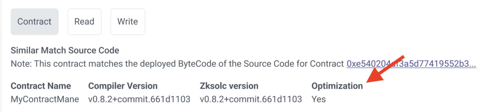
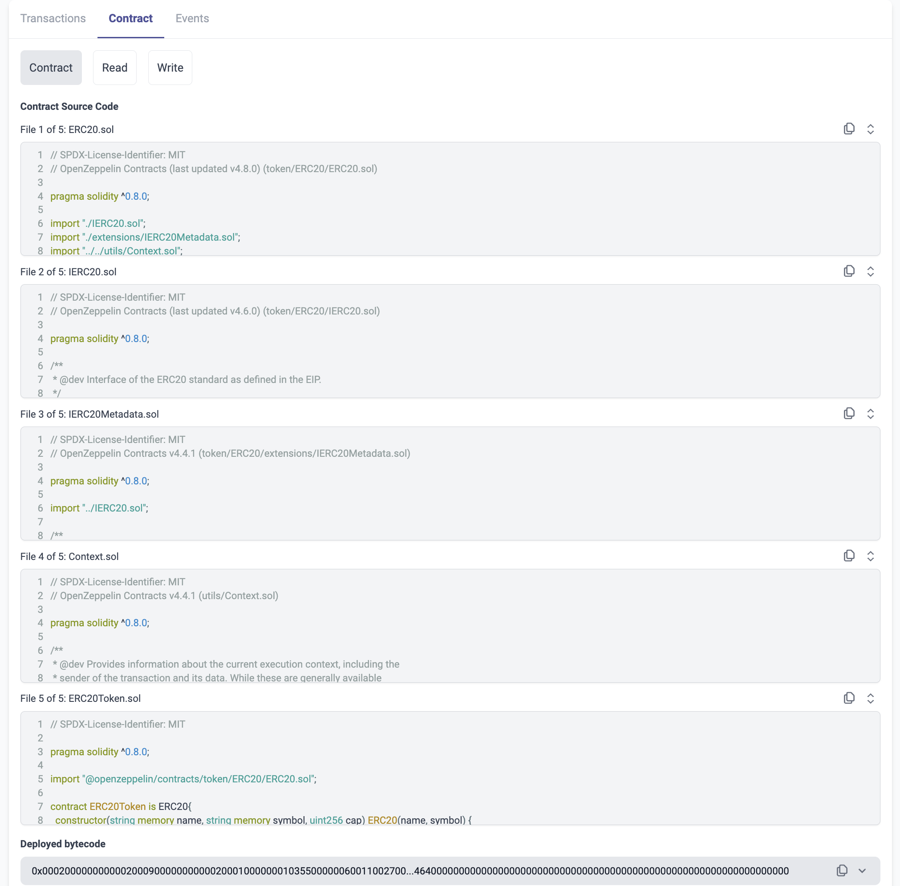

# id708 Contract page - Pages - Artifacts ("Contracts" tab for verified multi-file contract)

## Description
  - https://staging-scan-v2--pr292-dr-zkf-2842-support-hzmgsgbc.web.app/address/0x894DFD731681a8615614533637938a4e337d1F8f#contract

## Precondition

## Scenario
- Contract tab for verified multi-file contract contains:
    - Contract Name
    - Name of the contract displayed under the "Contract Name" title
      
- Compiler version
    - Version of compiler displayed under the "Compiler version" title
      
- Zksolc version
    - Version of zksolc displayed under the "Zksolc version" title
      
- Optimization
    - Optimization parameter (yes/no) displayed under the "Optimization" title
      
- Contract Source Code
    - Text displayed for each source code file
    - File \<number\> of \<general number of files for this multi-file contract\>
      
- File name
- Block with contract's code (displayed for each source code file)
- "Copy" button
- "Expand" button