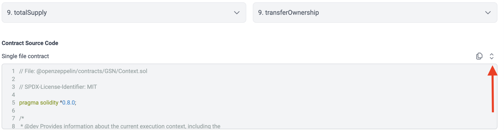
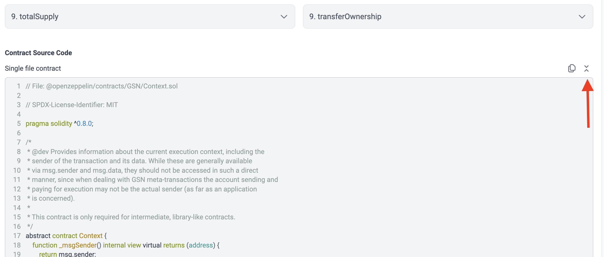

# id710 Contract page - Pages - Verify source code expanding  (Contract tab)

## Description
  - https://goerli.staging-scan-v2.zksync.dev/address/0x1bAbcaeA2e4BE1f1e1A149c454806F2D21d7f47C#contract

## Precondition

## Scenario
- Click "Expand" button of Source Code block
  
- Contract Source Code block expanded
- "Expand" button changed to "Compress"
  