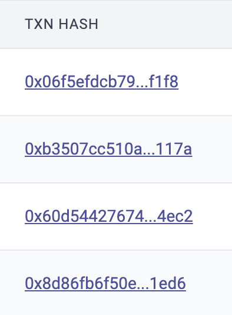
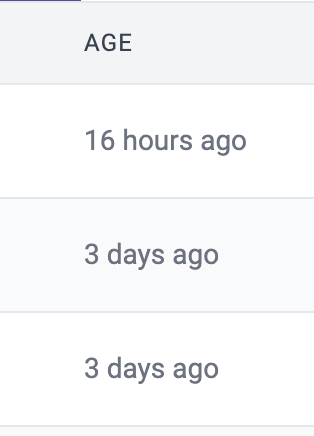
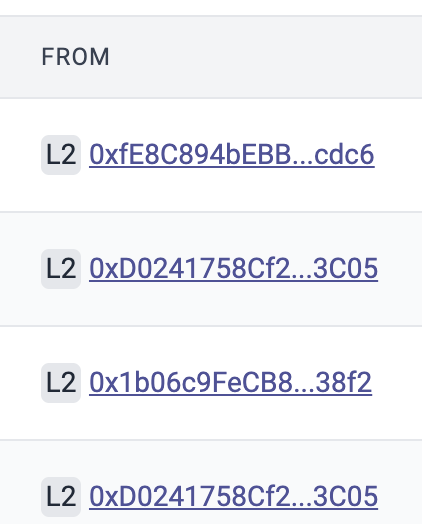
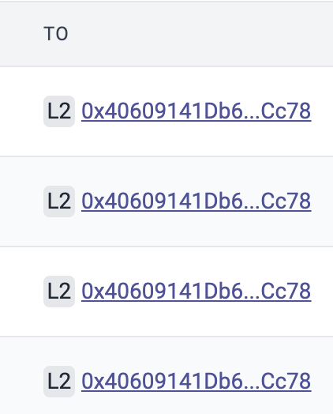
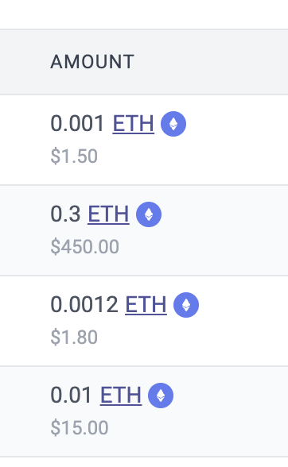
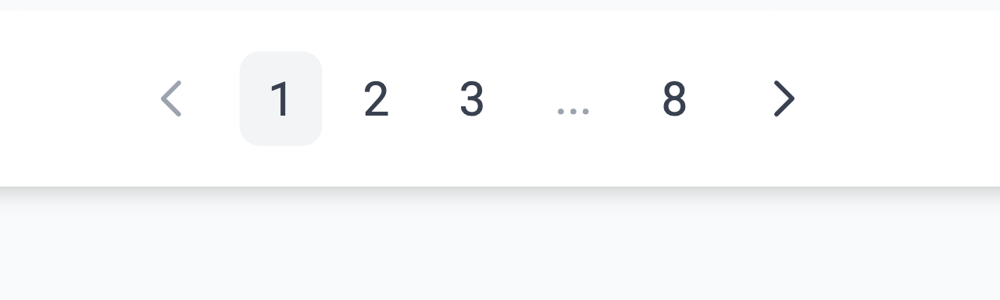

# id927 Contract page - Pages - Artifacts (Transactions) -  Transfers tab

## Description
  - https://sepolia.explorer.zksync.io/address/0x53d67E04c777a725C05399850eb942348444B5AF

## Precondition

## Scenario
- ERC20 Transfers tab contains:
    - Transaction hash

      
- Age
    - Can be copied

      
- From
    - L1/L2 displayed
  
      
- Direction
    - IN/OUT/SELF
  
      
- To
    - L1/L2 displayed
  
      
- Amount

  
- Pagination element (in case there are 10+ txs for this account)

  
