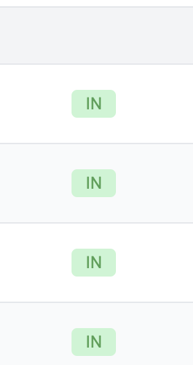

# id927 Contract page - Pages - Artifacts (Transactions) -  Transfers tab

## Description
  - https://goerli.explorer.zksync.io/address/0x40609141Db628BeEE3BfAB8034Fc2D8278D0Cc78

## Precondition

## Scenario
- ERC20 Transfers tab contains:
    - Transaction hash
      
- Age
    - Can be copied
      
- From
    - L1/L2 displayed
      
- Direction
    - IN/OUT/SELF
      
- To
    - L1/L2 displayed
      
- Amount
  
- Pagination element (in case there are 10+ txs for this account)
  
