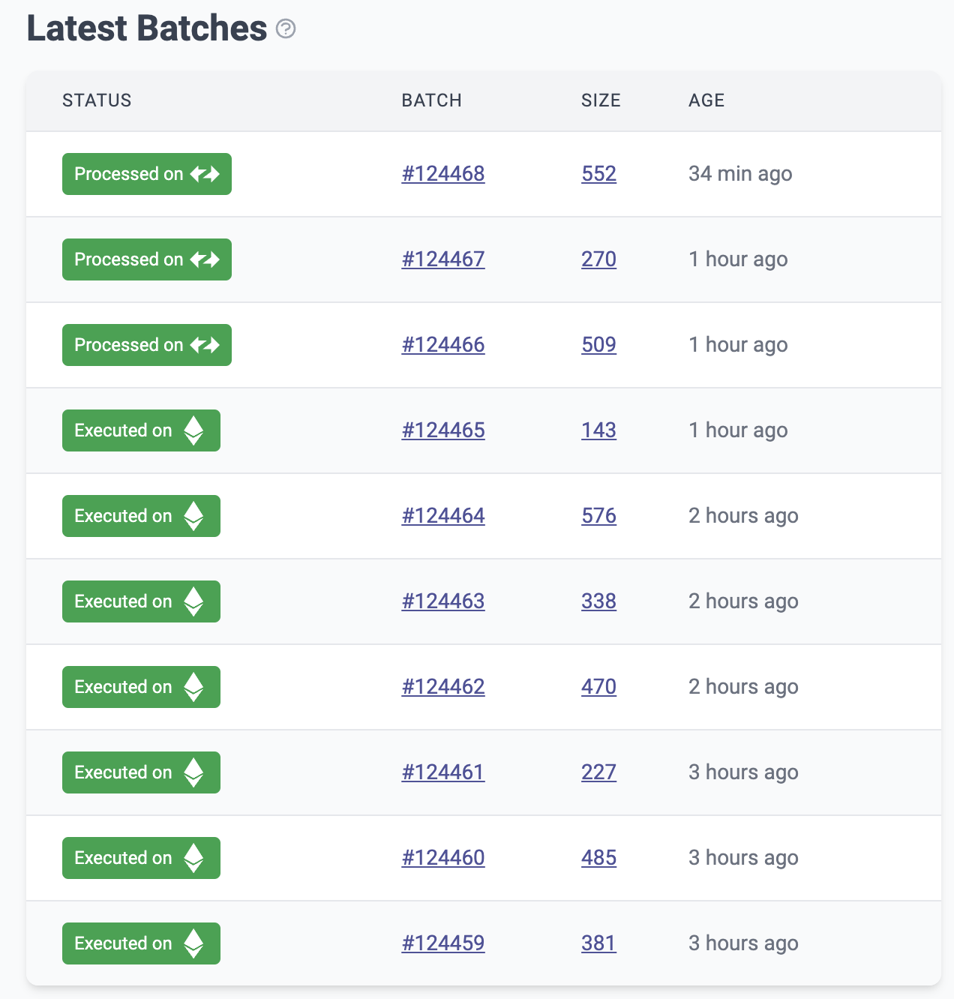

# id274 Dashboard - Pages - Artifacts (Latest Batches)

## Description
  - New status design
  - https://linear.app/matterlabs/issue/UEXP-4354/be-fe-redesign-batch-statuses-on-batches-list-page

## Precondition

## Scenario
- Latest Batches table has 10 lines
- Latest Batches has tooltip icon
    - Text reveal on hover
    - Latest batches submitted to Ethereum Network
- Latest Batches table contains:
    - Status
- Batch
- Size
- Age
  