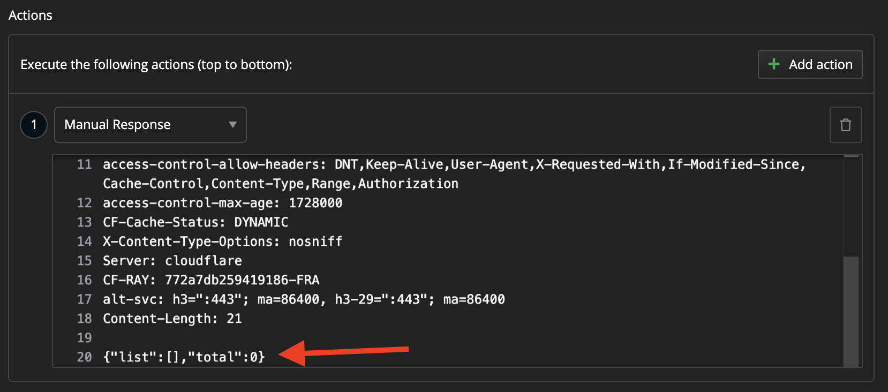
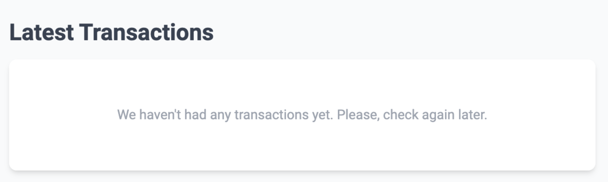

# id584 Dashboard - Pages - Verify empty state enabling (Latest Transactions)

## Description
  - Preconditions:
  - 1) Install Fiddler or au other traffic sniffer tool
  - 2) Open BE homepage https://sepolia.staging-scan-v2.zksync.dev/
  - 3) Find a quest with URL: https://zksync2-mainnet-explorer.zksync.io/transactions?limit=10&direction=older

## Precondition

## Scenario
- Simulate empty transactions request response
    - Modify response file - set '\{"list":[],"total":0\}' as response

- Verify empty state shown for Latest Transactions
  