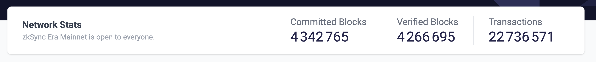

# id676 Dashboard - Pages - Artifacts (Network stats) [Mainnet]

## Description
  - url: https://explorer.zksync.io/

## Precondition

## Scenario
- Network stats contains:
    - Heading - "Network Stats"
- Text - "zkSync Era Mainnet is open to everyone."
- Committed Blocks
    - Number of blocks displayed under the title
- Verified Blocks
    - Number of blocks displayed under the title
- Transactions
    - Number of txs displayed under the title
      