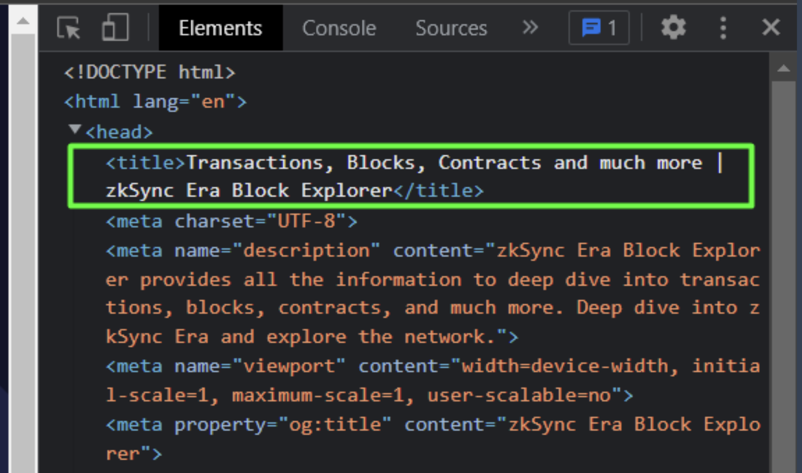
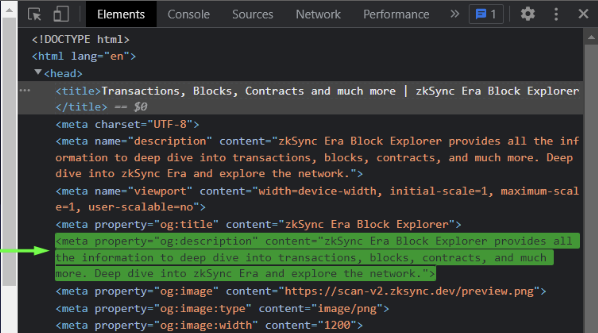
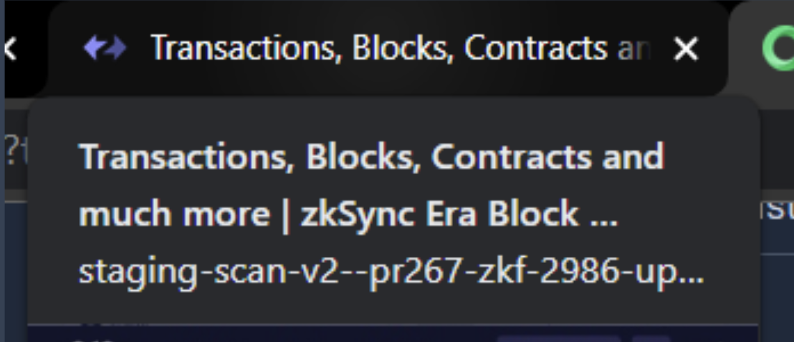
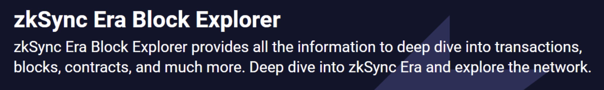

# id695 Common - Check metadata of the page (ENG)

## Description
  - Environment:https://goerli-beta.staging-scan-v2.zksync.dev/

## Precondition

## Scenario
- Open the Environment page
- Check that language is set to ENG
- Open Dev Chrome Tools (F12)
    - Open Elements tab
- Check that we have \<title\>Transactions, Blocks, Contracts and much more | zkSync Era Block Explorer\</title\>
  
- Check \<meta property="og:description" content="zkSync Era Block Explorer provides all the information to deep dive into transactions, blocks, contracts, and much more. Deep dive into zkSync Era and explore the network."\>
  
- Open new tab in the browser
    - Hover mouse over the tab with opened environment (step 1)
- Check that we have correct description "Transactions, Blocks, Contracts and much more | zkSync Era Block Explorer"
  
- Check the description of the block explorer
    - Title: zkSync Era Block Explorer
- Description: zkSync Era Block Explorer provides all the information to deep dive into transactions, blocks, contracts, and much more. Deep dive into zkSync Era and explore the network.
  