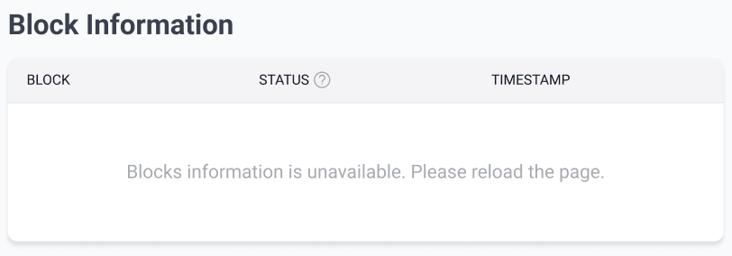

# id924 Dashboard - Pages - Verify Error messages for empty state (Blocks)

## Description
  - I am on https://staging-scan-v2.zksync.dev/block/block_number page

## Precondition

## Scenario
- Open Dev Tools
- Emulate an error when receiving the Block request
                - (e.g. block the block request in Dev Tools when loading "Block" page)
    - Verify error message is present:
    - "Block information is unavailable. Please reload the page.
