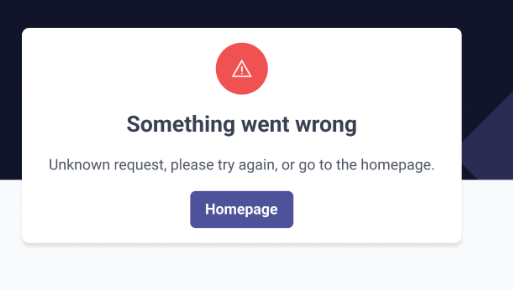

# id375 Error page - Pages - Verify Error page enabling for Transaction page

## Description
  - I am on https://staging-scan-v2.zksync.dev/tx/transaction_hash page

## Precondition

## Scenario
- Open Dev Tools
- Emulate an error when receiving the Tx request
                - (e.g. block tx request in Dev Tools when loading "Transaction" page)
    - Verify "Something went wrong" error shown on Transaction page
