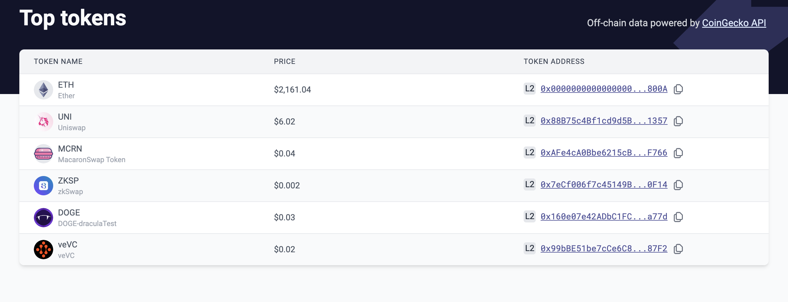

# id249 Tokens page - Pages - Artifacts

## Description
  - https://sepolia.staging-scan-v2.zksync.dev/tokenlist

## Precondition

## Scenario
- Top tokens page contains:
    - Text
    - Off-chain data powered by CoinGecko API
- Link
    - CoinGecko API
- Token list
    - Token name
- Price
- Token address
    - L2 label for contract address is displayed
      