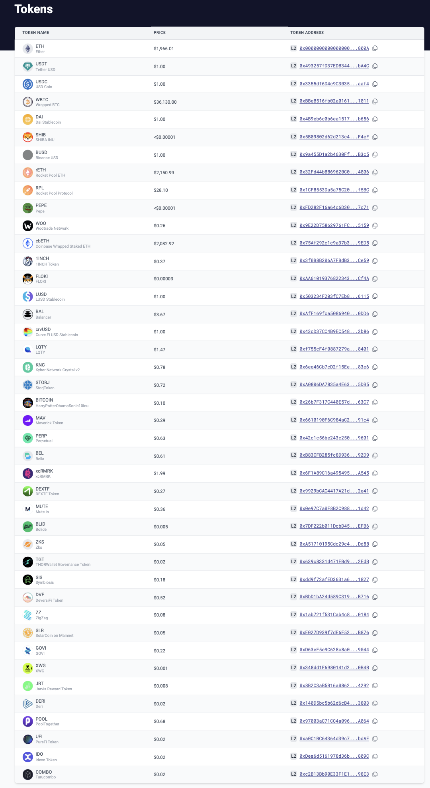

# id815 Tokens page - Pages - Token list (Mainnet)

## Description
  - https://staging-scan-v2.zksync.dev/tokenlist

## Precondition

## Scenario
- List if tokens available on Mainnet:
  - ETH
  - USDT
  - USDC
  - WBTC
  - DAI
  - SHIB
  - BUSD
  - rETH
  - RPL
  - PEPE
  - WOO
  - cbETH
  - 1INCH
  - FLOKI
  - LUSD
  - BAL
  - crvUSD
  - LQTY
  - KNC
  - STORJ
  - BITCOIN
  - MAV
  - PERP
  - BEL
  - xcRMRK
  - DEXTF
  - MUTE
  - BLID
  - ZKS
  - TGT
  - SIS
  - DVF
  - ZZ
  - SLR
  - GOVI
  - XWG
  - JRT
  - DERI
  - POOL
  - UFI
  - IDO
  - COMBO
  - LSD
  - UNIDX
  - SCM
  - BYN
  - TiUSD
  - PNDC
  - CNG
  - EPEP
  - iZi
  - iFARM
  - TiTi
  - WETH
  - wTBT
  - IBEX
- Each token has:
    - Ticker
- Full name
- Icon
- Tokens are sorted by liquidity
  