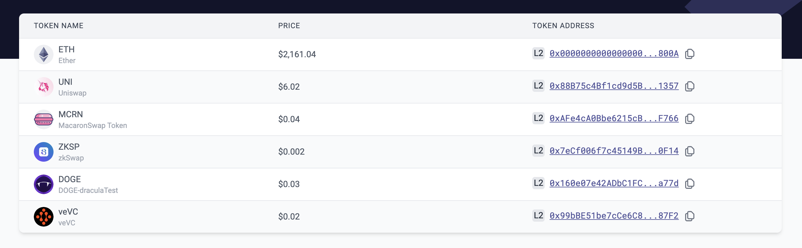

# id816 Tokens page - Pages - Token list (Testnet)

## Description
  - https://sepolia.staging-scan-v2.zksync.dev/tokenlist

## Precondition

## Scenario
- List if tokens available on Testnet:
  - ETH
  - UNI
  - MCRN
  - ZKSP
  - DOGE
  - veVC
  
- Each token has:
    - Ticker
- Full name
- Icon
