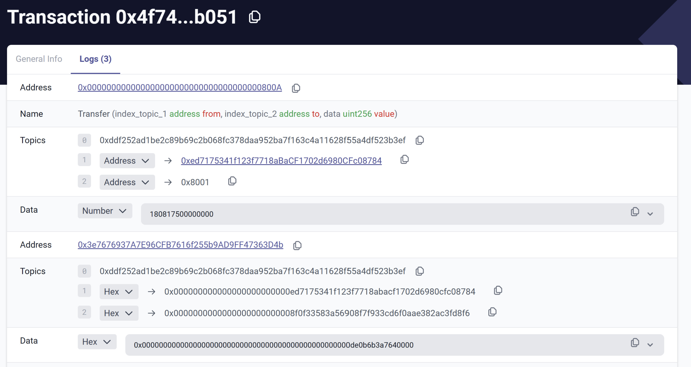

# id230 Tx Logs - Pages - Artifacts

## Description

## Precondition

## Scenario
- Transaction page --\> "Logs Tab" contains:
    - Address
- Name
- Topics
- Data
  
- Verified contract address:
    - Number data value
- Unverified contract address:
    - Hex data value
