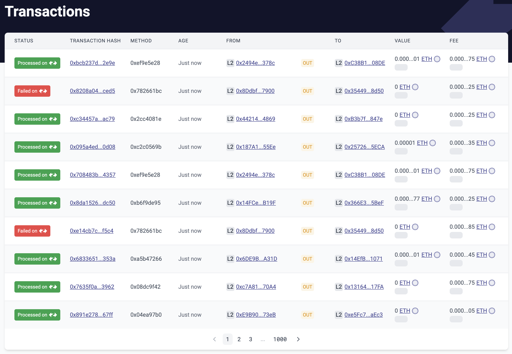

# id247 Txs page - Pages - Artifacts

## Description
  - New status design

## Precondition

## Scenario
- Transactions page contains 10 rows of:
    - Statuses
    - Failled on \<zkSync logo\>

  
    - Processed on \<zkSync logo\>

    - Executed on \<ETH logo\>

- Transaction Hash
- From Hash
- To In/Out/Self
- Nonce
- Amount
- Fee (Fee in ETH only)
- Age
    - Timestamp can be copied on click
      
