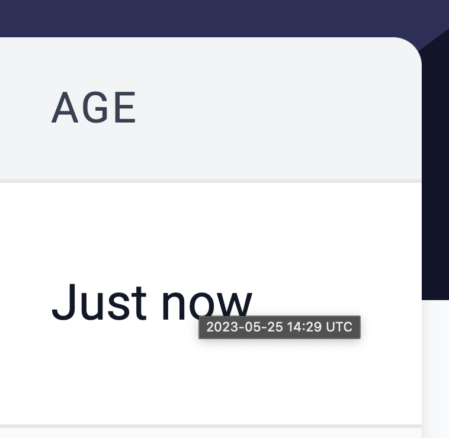

# id596 Txs page - Pages - Verify hover state for 'Age' field

## Description
  - https://goerli.explorer.zksync.io/transactions

## Precondition

## Scenario
- Open transactions page
- Homer the cursor over "Age" field of any transaction raw
- Verify tooltip with timestamp shown on hover
  