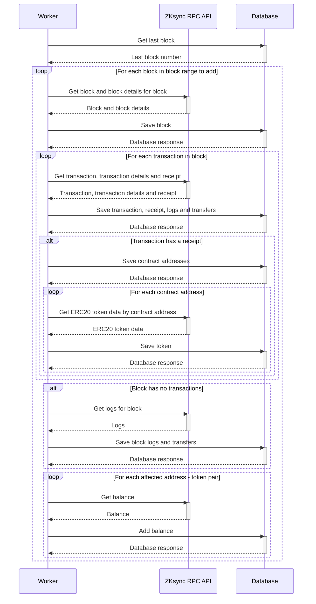

# Add block sequence diagram

```mermaid
sequenceDiagram
    participant Worker
    participant ZKsync RPC API
    participant Database
    Worker->>Database: Get last block
    activate Database
    Database-->>Worker: Last block number
    deactivate Database
    loop For each block in block range to add
        Worker->>ZKsync RPC API: Get block and block details for block
        activate ZKsync RPC API
        ZKsync RPC API-->>Worker: Block and block details
        deactivate ZKsync RPC API
        Worker->>Database: Save block
        activate Database
        Database-->>Worker: Database response
        deactivate Database
        loop For each transaction in block
            Worker->>ZKsync RPC API: Get transaction, transaction details and receipt
            activate ZKsync RPC API
            ZKsync RPC API-->>Worker: Transaction, transaction details and receipt
            deactivate ZKsync RPC API
            Worker->>Database: Save transaction, receipt, logs and transfers
            activate Database
            Database-->>Worker: Database response
            deactivate Database
            alt Transaction has a receipt
                Worker->>Database: Save contract addresses
                activate Database
                Database-->>Worker: Database response
                deactivate Database
                loop For each contract address
                    Worker->>ZKsync RPC API: Get ERC20 token data by contract address
                    activate ZKsync RPC API
                    ZKsync RPC API-->>Worker: ERC20 token data
                    deactivate ZKsync RPC API
                    Worker->>Database: Save token
                    activate Database
                    Database-->>Worker: Database response
                    deactivate Database
                end
            end
        end
        alt Block has no transactions
            Worker->>ZKsync RPC API: Get logs for block
            activate ZKsync RPC API
            ZKsync RPC API-->>Worker: Logs
            deactivate ZKsync RPC API
            Worker->>Database: Save block logs and transfers
            activate Database
            Database-->>Worker: Database response
            deactivate Database
        end
        loop For each affected address - token pair
            Worker->>ZKsync RPC API: Get balance
            activate ZKsync RPC API
            ZKsync RPC API-->>Worker: Balance
            deactivate ZKsync RPC API
            Worker->>Database: Add balance
            activate Database
            Database-->>Worker: Database response
            deactivate Database
        end
    end
```