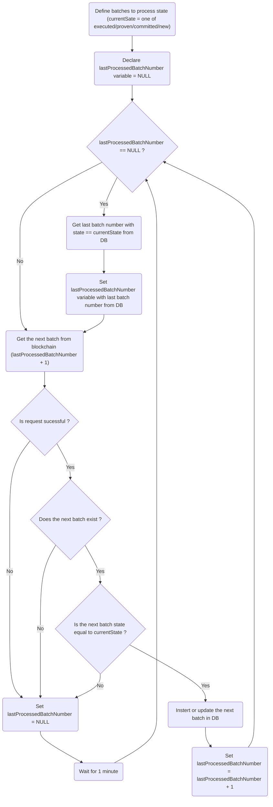

# Process batches flow

## The following process runs for each batch state (Executed, Proven, Committed, New):

### Batch state definition
Batch state is defined and used only internally. There are 4 batch states: `Executed`, `Proven`, `Committed` and `New`.
- `Executed` - batch has `executeTxHash` and `executedAt`.
- `Proven` - batch has `proveTxHash` and `provenAt`.
- `Committed` - batch has `commitTxHash` and `committedAt`.
- `New` - batch does't have any of `executeTxHash`, `proveTxHash` or `commitTxHash`.

Note, each `Executed` batch is also `Proven` and `Committed`, each `Proven` batch is also `Committed`.
