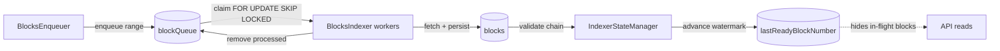

# Worker flow

```mermaid
flowchart LR
    Enq[BlocksEnqueuer] -->|enqueue range| Q[(blockQueue)]
    Q -->|claim FOR UPDATE SKIP LOCKED| Workers[BlocksIndexer workers]
    Workers -->|fetch + persist| Blocks[(blocks)]
    Workers -->|remove processed| Q
    Blocks -->|validate chain| ISM[IndexerStateManager]
    ISM -->|advance watermark| State[(lastReadyBlockNumber)]
    State -.->|hides in-flight blocks| API[API reads]
```
