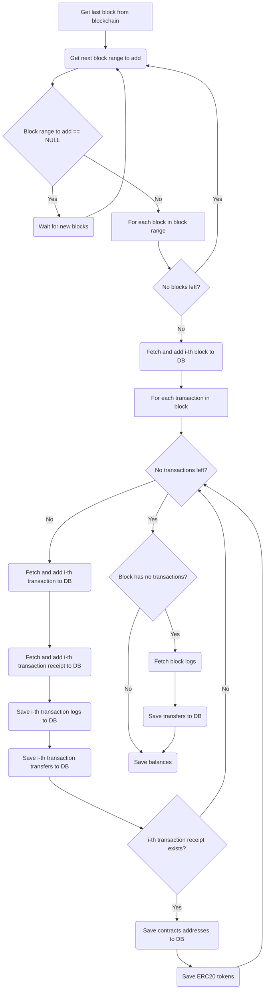

# Worker flow

```mermaid
flowchart
  GetLastBlock[Get last block from blockchain] --> GetNextBlockRangeToAdd(Get next block range to add)
  GetNextBlockRangeToAdd --> CheckBlockRangeToAddIsNull{Block range to add == NULL}
  CheckBlockRangeToAddIsNull --> |Yes| WaitForNewBlocks(Wait for new blocks)
  WaitForNewBlocks --> GetNextBlockRangeToAdd
  CheckBlockRangeToAddIsNull --> |No| ForEachBlock[For each block in block range]
  ForEachBlock --> CheckIfNoBlocksLeft{No blocks left?}
  CheckIfNoBlocksLeft --> |Yes| GetNextBlockRangeToAdd
  CheckIfNoBlocksLeft --> |No| GetBlockToAddDetails(Fetch and add i-th block to DB)

  GetBlockToAddDetails --> ForEachTransaction[For each transaction in block]
  ForEachTransaction --> CheckIfNoTransactionsLeft{No transactions left?}
  CheckIfNoTransactionsLeft --> |Yes| CheckIfBlockHasNoTransactions{Block has no transactions?}
  CheckIfNoTransactionsLeft --> |No| FetchAndAddTransaction(Fetch and add i-th transaction to DB)
  FetchAndAddTransaction --> FetchAndAddTransactionReceipt(Fetch and add i-th transaction receipt to DB)
  FetchAndAddTransactionReceipt --> SaveTransactionLogs(Save i-th transaction logs to DB)
  SaveTransactionLogs --> SaveTransactionTransfers(Save i-th transaction transfers to DB)
  SaveTransactionTransfers --> CheckIfTransactionReceiptExists{i-th transaction receipt exists?}
  CheckIfTransactionReceiptExists --> |No| CheckIfNoTransactionsLeft
  CheckIfTransactionReceiptExists --> |Yes| SaveContractAddresses(Save contracts addresses to DB)
  SaveContractAddresses --> SaveERC20Tokens(Save ERC20 tokens)
  SaveERC20Tokens --> CheckIfNoTransactionsLeft
  CheckIfBlockHasNoTransactions --> |No| SaveBalances
  CheckIfBlockHasNoTransactions --> |Yes| FetchBlockLogs(Fetch block logs)
  FetchBlockLogs --> SaveTransfers(Save transfers to DB)
  SaveTransfers --> SaveBalances(Save balances)
```