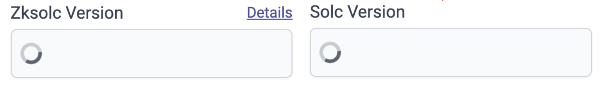

# id342 SmartContractVerification page - Common - Сheck Solc version dropdown pending state

## Description
  - https://staging-scan-v2.zksync.dev/contracts/verify

## Precondition

## Scenario
- Open Smart Contract Verification page
- Click Solc version dropdown
- Verify loader shown when request is pending
- Verify form buttons are disabled when request to list of versions is pending
  