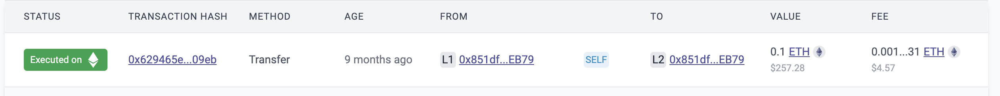

# id259 Acc page - Pages - Navigation

## Description
  - Input an account address to the search field, f.e. 0x73889BCc72bB17e9B0dD89fcAd04504458401288
  - url: https://staging-scan-v2.zksync.dev/address/0x73889BCc72bB17e9B0dD89fcAd04504458401288

## Precondition

## Scenario
- Links navigates user:
    - TX Hash -\> to Transaction
    - https://sepolia.explorer.zksync.io/tx/0xfbbea52f0e7d51e9a42a464173644975c891cc667ba0286217bd6784aa48ed3d
- From hash -\> to Account (internal link)
    - https://sepolia.etherscan.io/address/0x851df0eDcc4109C7E620d0AAdFDB99348821EB79
- To hash -\> to Account (internal link)
    - https://sepolia.explorer.zksync.io/address/0x851df0eDcc4109C7E620d0AAdFDB99348821EB79
- Fee -\> to Contract page
    - https://sepolia.explorer.zksync.io/address/0x000000000000000000000000000000000000800A
- Value - \> Contract page
    - https://sepolia.explorer.zksync.io/address/0x000000000000000000000000000000000000800A
    