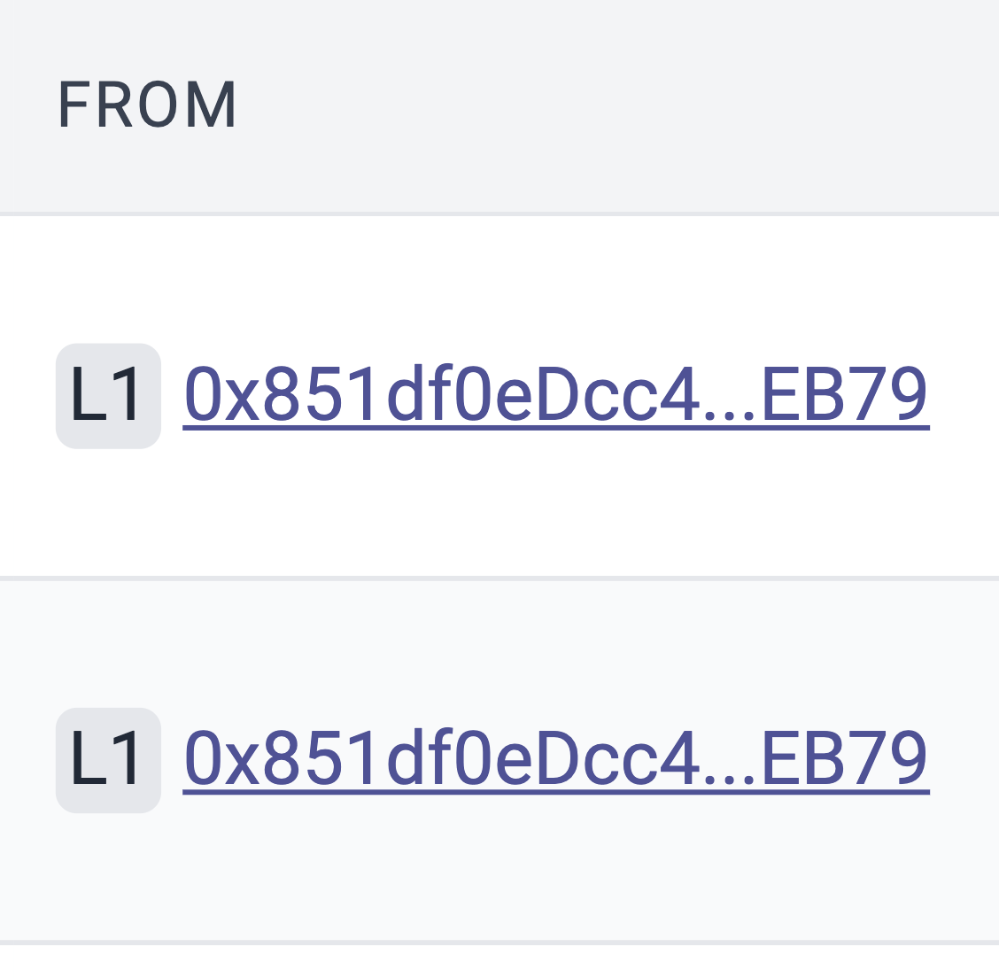

# id367 Acc page - Pages - L1 Redirection

## Description
  - Input an account address to the search field, f.e. 0x8f0F33583a56908F7F933cd6F0AaE382aC3fd8f6
  - url: https://staging-scan-v2.zksync.dev/address/0x8f0F33583a56908F7F933cd6F0AaE382aC3fd8f6
  - https://sepolia.explorer.zksync.io/address/0x851df0eDcc4109C7E620d0AAdFDB99348821EB79

## Precondition

## Scenario
- Links redirect user:
    - From hash -\> redirects to Etherscan (external link)
    - https://sepolia.etherscan.io/address/0xb5f25275c24b7dcc3012fef2e3519b1a2af6bf27
- To hash -\> to Etherscan (external link)
    - https://sepolia.etherscan.io/address/0xb5f25275c24b7dcc3012fef2e3519b1a2af6bf27
      