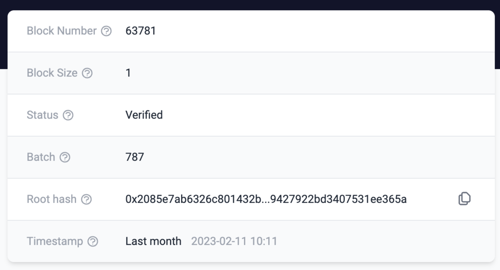

# id236 Block page - Pages - Artifacts (Left table)

## Description
  - /block/63781

## Precondition

## Scenario
- Left block table contains the following fields:
  - Block Number
  - Block Size
  - Status
  - Batch
  - Root Hash
  - Timestamp
  