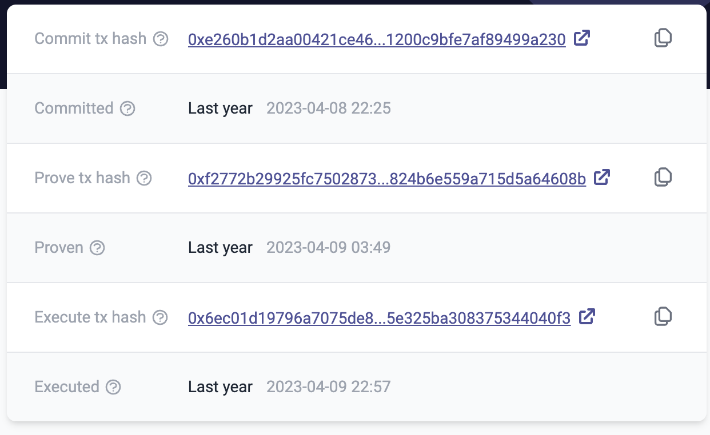

# id554 Block page - Pages - Verify hover state for links

## Description
  - Open https://explorer.zksync.io/block/1085863 page

## Precondition

## Scenario
- Verify links on the Block page change the color to bright purple in hover state
    - Commit tx hash link
    - https://sepolia.etherscan.io/tx/0xe260b1d2aa00421ce468dd37020b2344857b69c074d1200c9bfe7af89499a230
- Prove tx hash link
    - https://sepolia.etherscan.io/tx/0xf2772b29925fc7502873843b2f9ae3d660e69f98de824b6e559a715d5a64608b
- Execute tx hash link
    - https://sepolia.etherscan.io/tx/0x6ec01d19796a7075de85d294f922085821ad8611a705e325ba308375344040f3
- Transaction hash links
    - https://explorer.zksync.io/tx/0x2490042425e42e4ebe58a1315371d1d497c420ba0970f5c8025c6dc17ae4c936
- From links
    - https://explorer.zksync.io/address/0x4036dEdD441cEb2D544170c3177B4556f8657eDC
- To links
    - https://explorer.zksync.io/address/0x2da10A1e27bF85cEdD8FFb1AbBe97e53391C0295
- Amount token links
- Fee token links
  
