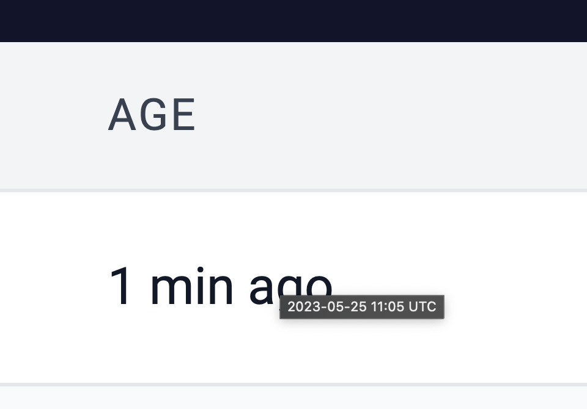

# id607 Blocks page - Pages - Verify hover state for 'Age' field

## Description
  - https://sepolia.explorer.zksync.io/blocks/

## Precondition

## Scenario
- Open blocks page
- Hover the cursor over "Age" field of any block raw
- Verify tooltip with timestamp shown on hover
  