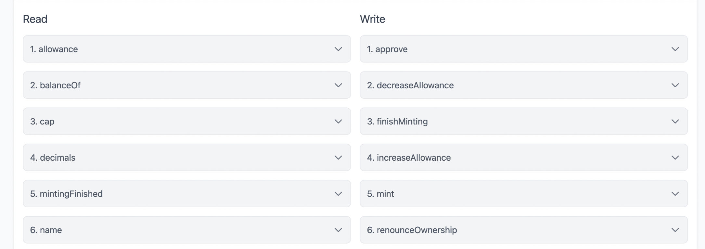

# id428 Contract page - Pages - Verify method components on the "Contracts" tab

## Description
  - https://staging-scan-v2.zksync.dev/address/contract_address
  - Prerequisites: (you can use https://github.com/JackHamer09/zkSync-2.0-Hardhat-example guide) or search for 0x772ab24587013a106e08f3868ef18361c8f3a4da contract
  - 1. upload your own contract with methods
  - 2. verify this contract

## Precondition

## Scenario
- Open Contract's page
- Click on the "Contract" tab
- Verify method components are displayed as drop downs
- Verify all of the drop downs are collapsed by default
- Verify the component reveals after clicking on the drop down
  