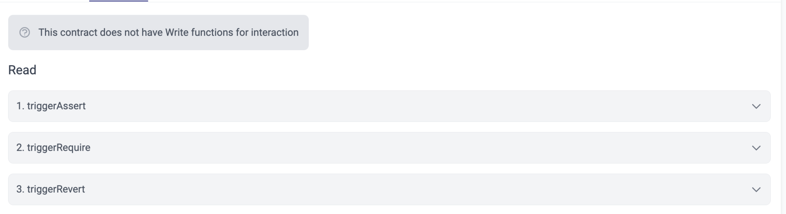

# id617 Contract page - Pages - Verify "Contract" tab of pure functions with only Read methods

## Description
  - https://sepolia.staging-scan-v2.zksync.dev/address/0xe51268b15fa9c9fc69213f6815210e791472a4fb#contract
  - Prerequisites: open page of contract with pure functions or search for 0xe51268b15fa9c9fc69213f6815210e791472a4fb contract

## Precondition

## Scenario
- Open Contract's page
- Click on the "Contract" tab
- Verify functions are visible under a Read section
- Verify no MetaMask connect button displayed
  