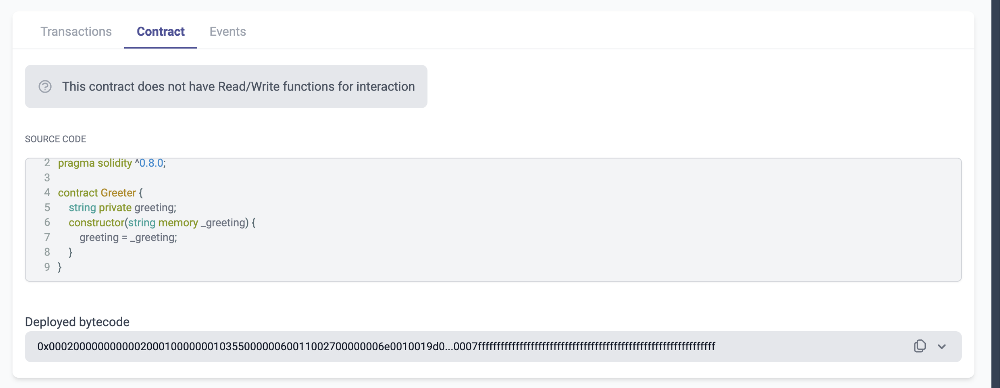

# id618 Contract page - Pages - Empty state of "Contract" tab for pure functions

## Description
  - https://sepolia.staging-scan-v2.zksync.dev/address/0xe51268b15fa9c9fc69213f6815210e791472a4fb#contract
  - Prerequisites: open page of contract with pure functions (when no functions are available to interaction) or search for 0xe51268b15fa9c9fc69213f6815210e791472a4fb contract

## Precondition

## Scenario
- Open Contract's page
- Click on the "Contract" tab
- Verify no Write/Read headers displayed
  
- Verify no MetaMask connect button displayed
- Text shown
    - This contract does not have Read/Write functions for interaction
