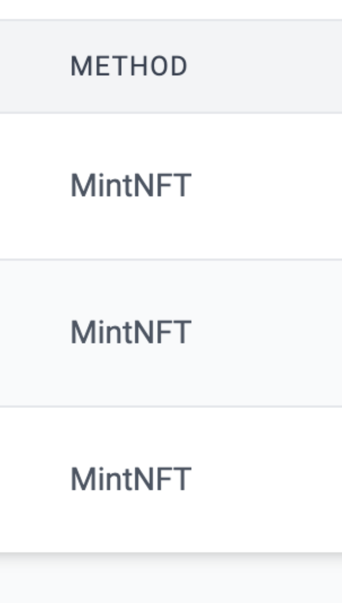

# id619 Contract page - Pages - Verify "Method" column for method names with abbreviations

## Description
  - https://sepolia.staging-scan-v2.zksync.dev/address/0x4A80888F58D004c5ef2013d2Cf974f00f42DD934 - page for verified contract, method name has abbereviation

## Precondition

## Scenario
- Open page for verified contract
- Verify "Method" column displayed for verified contract in "Transactions" tab
- Verify  exact method name displayed in method name column  (with no extra spaces)
  