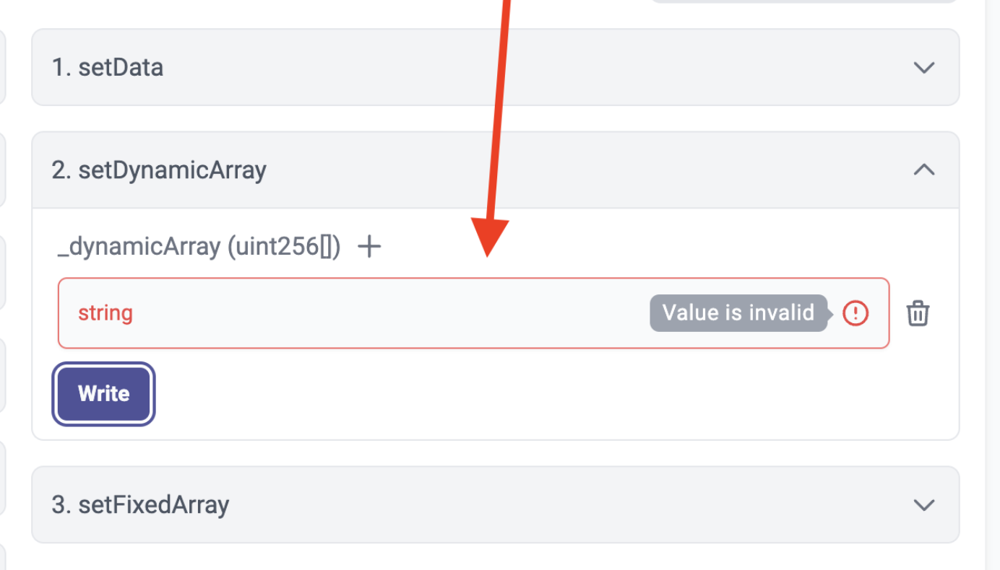

# id659 Contract page - Pages - Verify error message when submitting incorrect input

## Description
  - https://sepolia.staging-scan-v2.zksync.dev/address/0x53d67E04c777a725C05399850eb942348444B5AF#contract

## Precondition

## Scenario
- Open Contract's page
- Click on the "Contract" tab
- Verify Icon "+" is available for parameter if this parameter could accept several values.
- Click "+" button
- One more input for this parameter is added
- Enter incorrect input (e.g. text string in uint256 field)
- Click "Write" button
- Verify error message displayed for the field with incorrect input
  