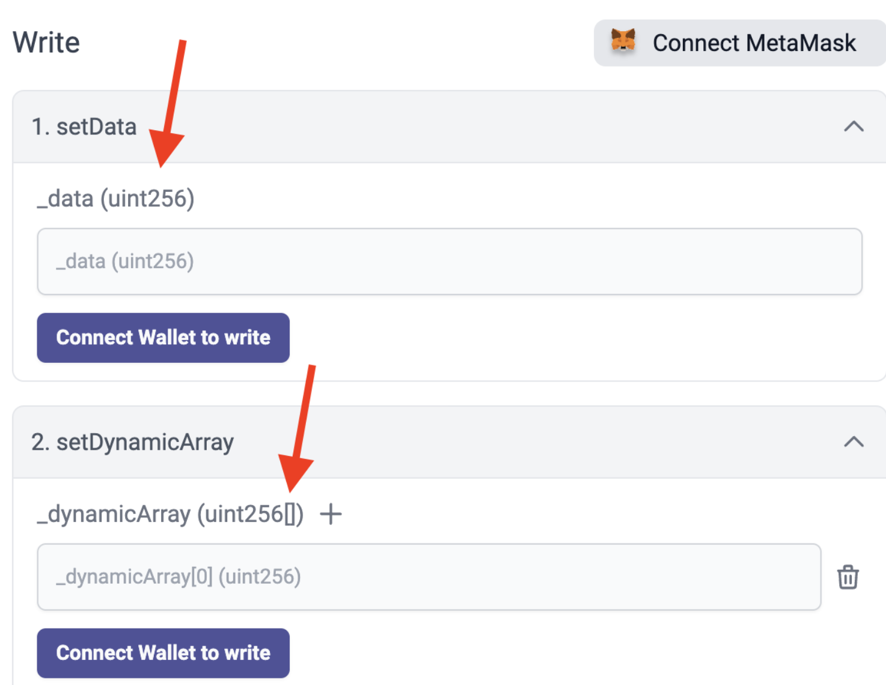

# id660 Contract page - Pages - Verify "+" button for adding inputs for methods

## Description
- https://sepolia.staging-scan-v2.zksync.dev/address/0x53d67E04c777a725C05399850eb942348444B5AF#contract

## Precondition

## Scenario
- Open Contract's page
- Click on the "Contract" tab
- Verify "+" button shown only for writing methods which can receive an array as an input - value type has [] (e.g. uint 256[])
- Verify button "+" isn't available for parameter if this parameter could accept single value (e.g. uint256).
  