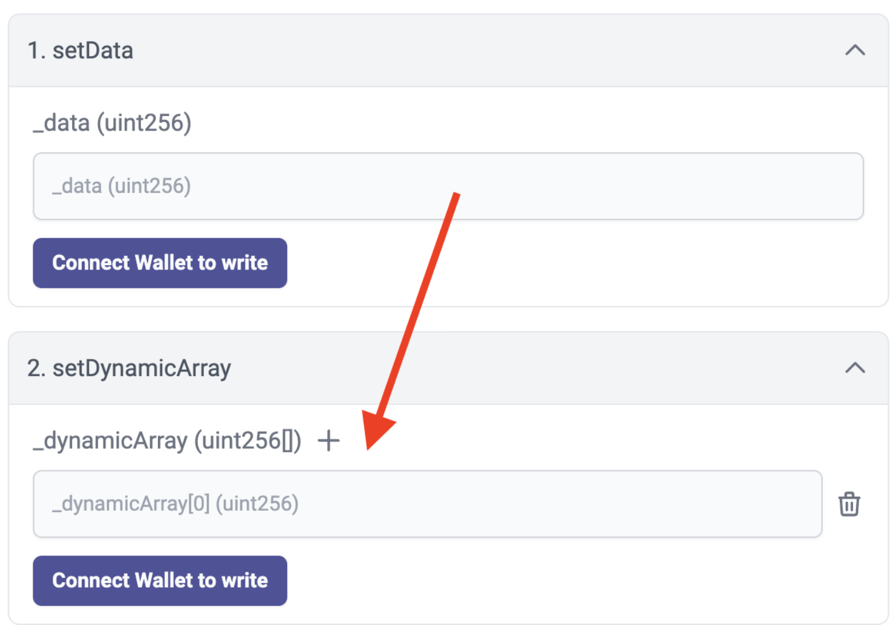
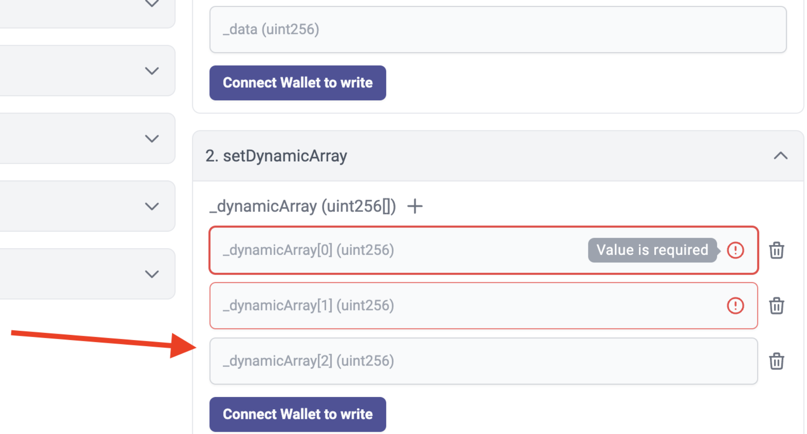

# id661 Contract page - Pages - Verify dynamic arrays as an input

## Description
  - https://sepolia.staging-scan-v2.zksync.dev/address/0x53d67E04c777a725C05399850eb942348444B5AF#contract

## Precondition

## Scenario
- Open Contract's page
- Click on the "Contract" tab
- Click "setDynamicArray" dropdown (method with dynamic array)
- Verify only one input is displayed by default
  
- Click "+" button to add one more input
- Verify only last input can be empty (newly added inputs are highlighted and value is required)
  
- Verify more inputs can be added or removed (using "+" and "Remove" buttons)