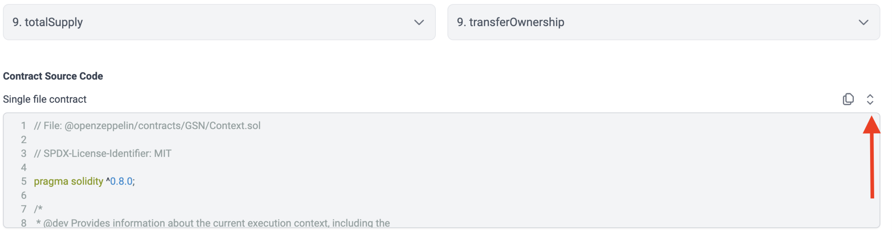
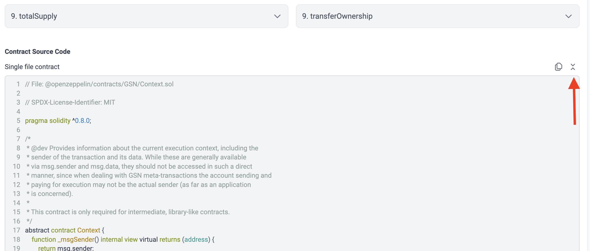

# id710 Contract page - Pages - Verify source code expanding  (Contract tab)

## Description
  - https://sepolia.staging-scan-v2.zksync.dev/address/0x53d67E04c777a725C05399850eb942348444B5AF#contract

## Precondition

## Scenario
- Click "Expand" button of Source Code block
  
- Contract Source Code block expanded
- "Expand" button changed to "Compress"
  