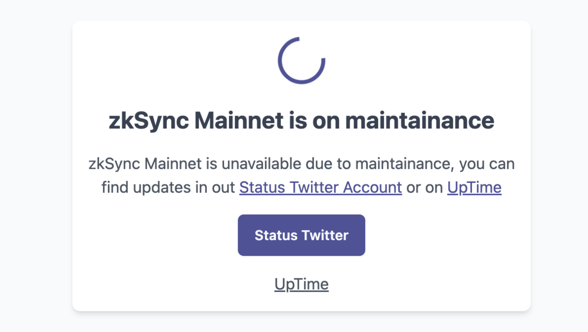

# id366 Maintenance page - Pages - Verify Maintenance enabling

## Description

## Precondition

## Scenario
- Open Firebase console https://console.firebase.google.com/project/staging-scan-v2/firestore/data/~2Fconfig~2Fv1
- Set "Maintenance" parameter ON
- Open Block Explorer URL
- Verify Maintenance page shown
  